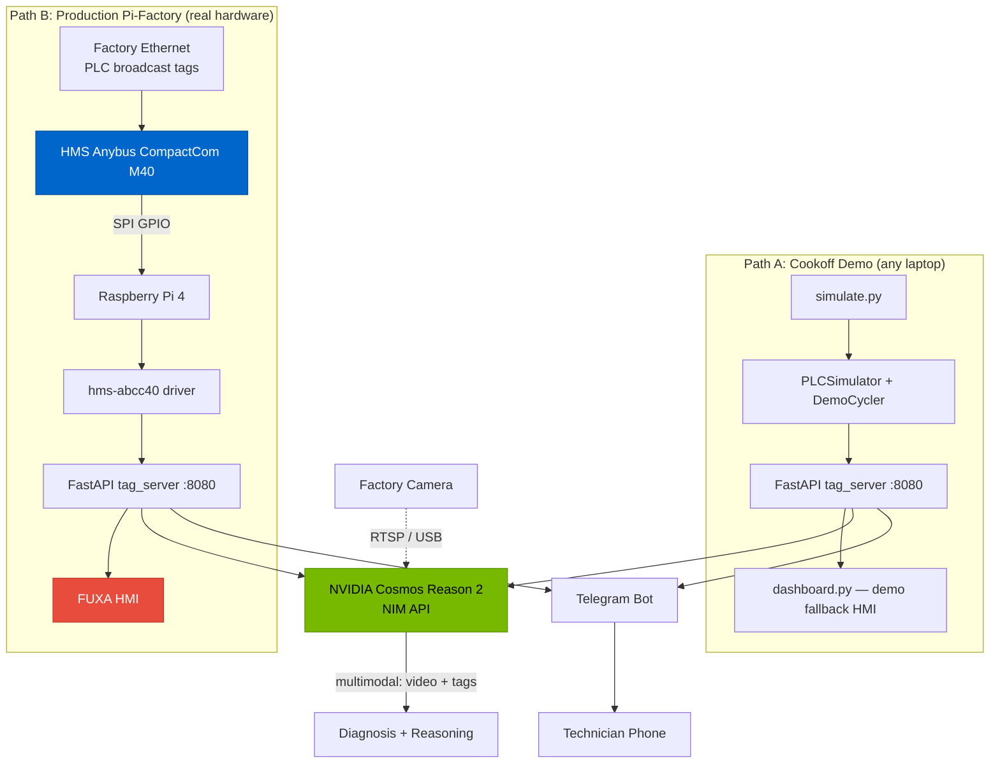

# Pi-Factory Architecture

## Dual-Path Design

Pi-Factory runs the same core stack in two modes:

- **Path A (Demo/Simulation)**: `simulate.py` drives a `PLCSimulator` that produces fake PLC tags. Runs on any laptop. Used for the Cookoff demo.
- **Path B (Production)**: A Raspberry Pi 4 with an HMS Anybus CompactCom M40 reads real broadcast PLC tags from the factory network. Used in production.

The only difference is the tag source — everything downstream (FastAPI server, fault classifier, Cosmos R2, Telegram bot) is identical.

## System Diagram



## Component Detail

### Tag Server (`pifactory/backend/tag_server.py`)

The central API hub. Endpoints:

| Endpoint | Method | Purpose |
|----------|--------|---------|
| `/api/tags` | GET | Latest tag snapshot from hardware or simulator |
| `/api/faults` | GET | Rule-based fault detection from current tags |
| `/api/diagnose` | POST | AI diagnosis via Cosmos R2 (or stub) |
| `/api/combined` | GET | Single call for dashboard: tags + faults + diagnosis |
| `/api/health` | GET | Service health and configuration status |
| `/` | GET | Demo dashboard HTML |
| `/docs` | GET | Auto-generated OpenAPI documentation |

**Hardware switch**: On startup, reads `ANYBUS_HARDWARE` env var:
- `false` (default): Instantiates `PLCSimulator`, polls via `DemoCycler`
- `true`: Imports `hms.abcc40.AnybusDriver`, reads tags from real fieldbus hardware
- Both paths produce the same `dict[str, Any]` tag snapshot

### Cosmos Reasoner (`pifactory/cosmos/reasoner.py`)

Async HTTP client for NVIDIA Cosmos Reason 2 NIM API.

- **Real mode**: Sends multimodal prompts (text + video) to NIM, parses `<think>` reasoning blocks
- **Stub mode**: Returns realistic fault-specific responses when no API key is set
- **Fallback chain**: Cosmos R2 → Llama 3.1 70B → stub responses
- **Parameters**: `temperature=0.6`, `top_p=0.95`, `max_tokens=4096`

### Fault Classifier (`pifactory/simulator/fault_classifier.py`)

Rule-based fault detection engine. Runs before Cosmos for instant results:

| Code | Severity | Condition |
|------|----------|-----------|
| E001 | EMERGENCY | E-stop active |
| M001 | CRITICAL | Motor current > 5.0A |
| T001 | CRITICAL | Temperature > 80°C |
| C001 | CRITICAL | Both sensors active (jam) |
| M002 | CRITICAL | Motor stopped unexpectedly |
| P001 | WARNING | Pressure < 60 PSI |
| M003 | WARNING | Motor speed mismatch |
| T002 | WARNING | Temperature 65-80°C |

### DemoCycler (`pifactory/simulator/plc_sim.py`)

Auto-cycles the simulator through phases for hands-free demos:

```
0%–33%   NORMAL    → healthy tags, nominal readings
33%–50%  WARNING   → temperature creeping up
50%–83%  FAULT     → conveyor jam injected
83%–100% RECOVERY  → faults cleared, cooling down
```

Default cycle: 60 seconds. Configurable via `--cycle` flag.

### Telegram Bot (`pifactory/telegram/bot.py`)

python-telegram-bot v20+ with async handlers:
- `/status` — formatted PLC tag summary
- `/see` — triggers Cosmos R2 analysis
- `/alarms` — active fault list
- `/conflicts` — tag consistency checks
- Auto-push on fault severity transitions (critical/emergency)

### FUXA Integration (Production)

[FUXA](https://github.com/frangoteam/FUXA) is the production HMI. `firstrun.sh` installs it via npm on the Pi. It connects to the same FastAPI tag server endpoints.

## Data Flow

```
Tags (sim or hardware)
  → tag_server.py stores latest snapshot
  → fault_classifier.py detects faults (rule-based, instant)
  → reasoner.py sends tags + faults + video to Cosmos R2 (on demand)
  → <think> reasoning parsed and displayed
  → Telegram bot pushes alerts on severity transitions
```

## Deployment

### Demo (any machine)
```bash
python simulate.py --nim-key=nvapi-xxx --telegram
```

### Production (Raspberry Pi 4)
```bash
sudo ./pifactory/setup/firstrun.sh
# → Installs deps, FUXA, systemd services
# → Pi boots into working Pi-Factory on next restart
```
